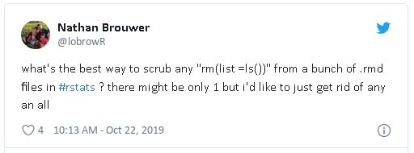
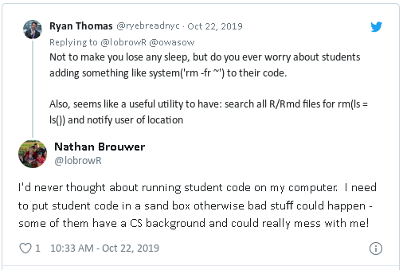

<!-- README.md is generated from README.Rmd. Please edit that file -->

# hazmat 

<!-- badges: start -->

[](https://www.tidyverse.org/lifecycle/#experimental)
[](https://CRAN.R-project.org/package=hazmat)
[](https://travis-ci.org/actuarialvoodoo/hazmat)
[](https://codecov.io/gh/actuarialvoodoo/hazmat?branch=master)
[](https://ci.appveyor.com/project/actuarialvoodoo/hazmat)
<!-- badges: end -->

The goal of hazmat is to provide a simple way for educators, and other
folks that need to run a lot of other people’s code, to have some
confidence that there aren’t any unexpected *scary* R snippets.

This package was motivated by this exchange on twitter.
<a href='https://twitter.com/ryebreadnyc/status/1186665880098430977'></a>

<a href='https://twitter.com/ryebreadnyc/status/1186665880098430977'></a>

## Installation

``` r
# install.packages("devtools")
devtools::install_github("actuarialvoodoo/hazmat")
```

## Usage

Currently, hazmat supports searching individual files or all R/Rmd files
in a folder for the following hazardous code snippets:

  - setwd
  - system
  - rm(ls = ls()).

<!-- end list -->

``` r
library(hazmat)
## basic example code

screen_folder("examples")
#> == File: examples/test_file.R ==
#> 🔥 4:     rm(ls = ls())
#> 🔔 8:     system('pwd')
```

-----

Please note that the ‘hazmat’ project is released with a [Contributor
Code of Conduct](CODE_OF_CONDUCT.md). By contributing to this project,
you agree to abide by its terms.
